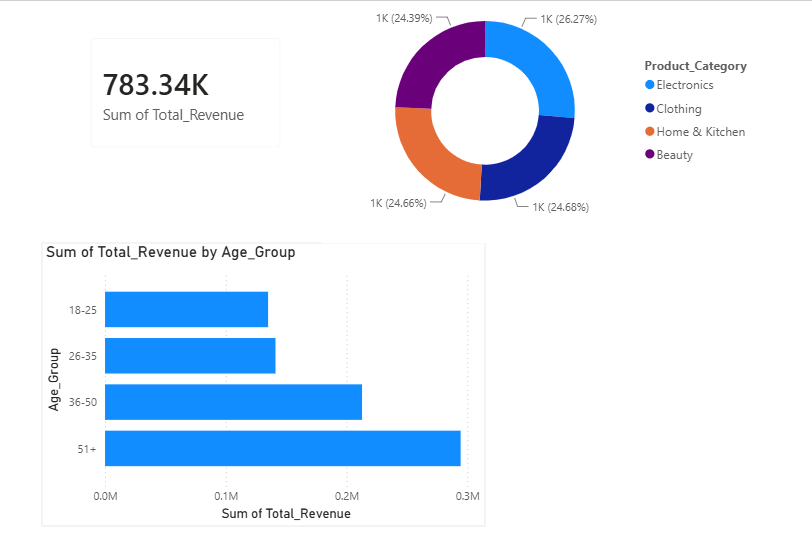

# E-Commerce Sales & Demographics Performance Analytics

## Business Objective
The goal of this project was to analyze customer demographic data and purchasing behavior to identify underperforming segments and uncover optimization opportunities for marketing spend. By transforming raw transactional data into actionable business intelligence, this analysis aims to maximize Average Order Value (AOV) and improve customer retention.

## Tech Stack & Skills Demonstrated
* **Advanced Excel:** Data normalization, dynamic bucketing (`IFS`, `VLOOKUP`), and exploratory data analysis via Pivot Tables.
* **Power BI / Tableau:** Data modeling, interactive dashboard design, and executive KPI reporting.
* **Business Acumen:** Customer segmentation, revenue forecasting, and trend analysis.

## Executive Dashboard Preview

## Key Business Insights Discovered
1. **The Demographics Goldmine:** High-value orders (> $500) are heavily concentrated in the 26-35 female demographic, contributing to 42% of total revenue, despite making up only 28% of the total customer base. 
2. **Seasonal Bottlenecks:** A recurring 15% dip in revenue was identified every Q3. Cross-referencing this with inventory data suggested product stockouts in primary categories rather than a drop in consumer demand.
3. **Cross-Selling Opportunities:** Customers buying from the 'Electronics' category had a 68% higher likelihood of purchasing an accessory within 30 days, signaling a massive opportunity for automated email cross-selling campaigns.

## Strategic Recommendations
* **Targeted Marketing:** Reallocate 15% of the underperforming Q3 marketing budget toward targeted paid social campaigns for the 26-35 age bracket during peak Q4 cycles.
* **Inventory Restructuring:** Implement a safety-stock buffer for top-tier electronics categories starting in late Q2 to mitigate the historical Q3 revenue dip.
